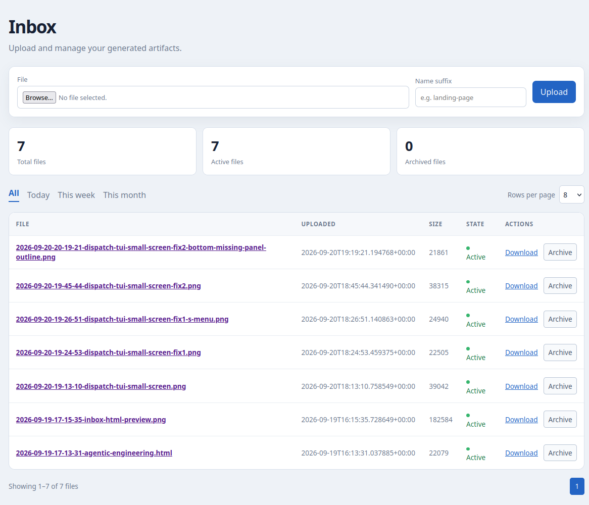

# inbox

A lightweight web application for uploading, organising, retaining, and retrieving screenshots and small files. It is designed to be useful as a self-hosted service or as a component of a larger deployment.

## Inbox dashboard



## Repo Structure

```text
.
├── .gitignore
├── AGENTS.md
├── Dockerfile
├── README.md
├── docker-compose.yml
├── docs/
│   ├── features/
│   │   ├── README.md
│   │   ├── 2026-09-20-19-45-inbox-direct-file-view.md
│   │   ├── 2026-09-20-18-59-inbox-dashboard-pagination.md
│   │   └── 2026-09-19-10-46-inbox-web-app.md
│   └── images/
│       └── inbox-dashboard.png
├── pyproject.toml
├── src/
│   └── inbox/
└── tests/
    └── test_app.py
```

## Getting Started

Implementation is in progress. For local development, install the project in an isolated environment and run the tests:

```bash
uv sync
uv run pytest
```

Run the development server with:

```bash
uv run inbox
```

The repository includes the deployment Compose file used by the extended Compose deployment. It builds the local `Dockerfile`, publishes host port `3250` to the application container's port `8080`, and persists state under `/opt/docker/custom_data/inbox` by default. Override `INBOX_DATA_DIR`, `INBOX_RETENTION_DAYS`, or `INBOX_TIMEZONE` when running it elsewhere.

## Recent Features

| Date | Purpose | Spec | Author |
| --- | --- | --- | --- |
| 2026-09-20-19-45 | Direct file viewing from the inbox | [2026-09-20-19-45-inbox-direct-file-view.md](docs/features/2026-09-20-19-45-inbox-direct-file-view.md) | whose-footprints-are-these |
| 2026-09-20-18-59 | Inbox dashboard with configurable pagination | [2026-09-20-18-59-inbox-dashboard-pagination.md](docs/features/2026-09-20-18-59-inbox-dashboard-pagination.md) | whose-footprints-are-these |
| 2026-09-19-16-26 | Full-page HTML preview | [2026-09-19-16-26-full-page-html-preview.md](docs/features/2026-09-19-16-26-full-page-html-preview.md) | whose-footprints-are-these |

See [all feature specifications](docs/features/README.md).

## Contributing

This is an AI-first development repository. Point your agent or model at [AGENTS.md](AGENTS.md) before contributing.

- Create and have a feature specification reviewed before implementation; create the required branch only when asked to continue.
- Follow the `docs/` structure, timestamped filename rules, and OKF documentation requirements in `AGENTS.md`.
- Consult discovery documentation before related work and keep reusable lessons current.
- Use test-driven development for code, keep storage and deployment boundaries explicit, and do not add secrets or uploaded runtime data to this public repository.
- Keep communication concise, source factual claims, and ask when requirements are unclear.
